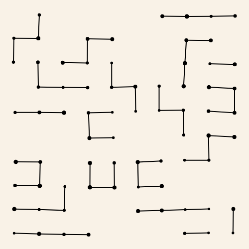
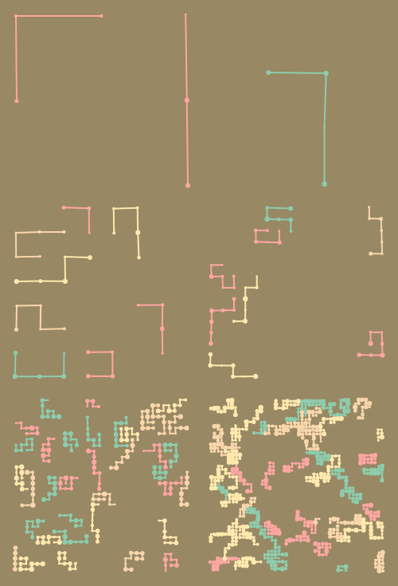

# barritas

This is a small project trying to replicate some of the doodles I do on paper but with some coding and using [canvas-sketch](https://github.com/mattdesl/canvas-sketch).


It can generate some simple drawings like: .

Or something more complicated (and ugly in my opinion) like: .

To do so all you need to do is adjust the configuration variables:

```javascript
const margin = 10;
const drawGrid = false;
const useColors = true;
const randomBackground = true;
const multiDoodle = true;
```